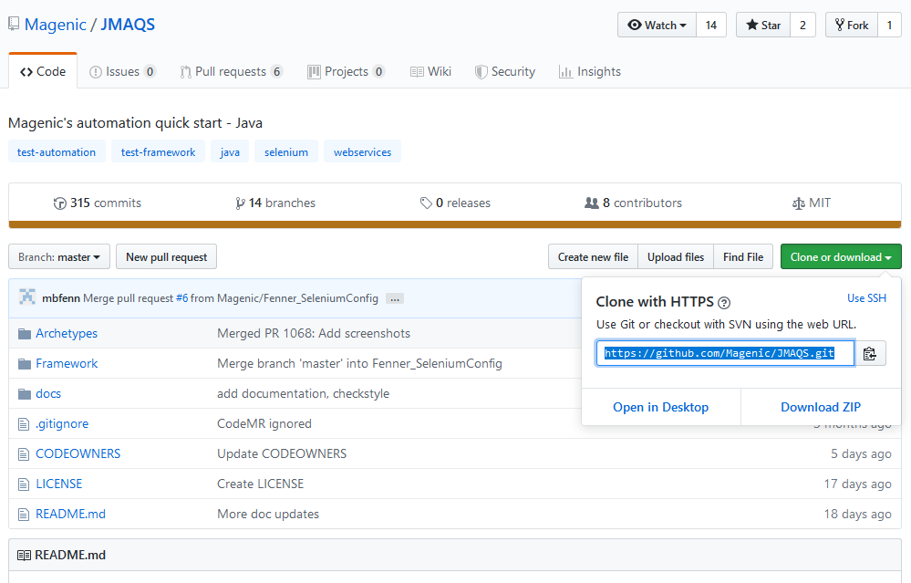

#  JMAQS Contribution Set Up Guide

---

[Git Bash](#Git Bash)  
[VS Code](#VS Code)  
[IntelliJ](#IntelliJ)

## Cloning

### Git Bash
1. Navigate to [https://github.com/Magenic/JMAQS](https://github.com/Magenic/JMAQS)
2. Click the **Clone or download button**
3. Copy the URL - [https://github.com/Magenic/JMAQS.git](https://github.com/Magenic/JMAQS.git)
   
4. Open Git Bash and navigate to where you want the repo to be
5. Right click in Git Bash, paste the URL copied from GitHub, and hit enter
6. You should now have the JMAQS project in your file structure

### VS Code

#### I. If you have cloned via Git Bash
1. Click Open Folder
2. Navigate to the JMAQS folder
3. Click Select Folder

#### II. if the repo has not been cloned
1. Click the "Clone Git Repository" button
2. Click "Clone from GitHub"
3. Login to your git-hub account  
(if you don't have an account, use the Git Bash instructions)
4. Type in: Magenic/JMAQS and select it in the dropdown
5. Select the location you want the repo to be

### IntelliJ
