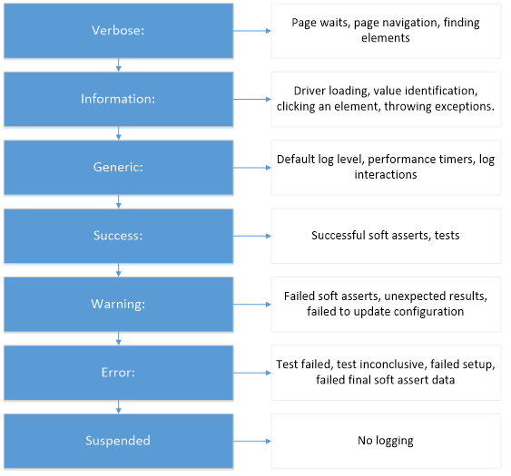

#  JMAQS FAQ

# Open source
As of July 2020, JMAQS became fully open source.  

## Template types
- Java Framework project templates - These templates are available to Magenic clients
    - Appium (with tests and page object models)
    - Base
    - Composite (mix and match all JMAQS capabilities)
    - Database
    - Selenium (with tests and page object models)
    - Web Service (with tests, json models and xml models)

# Base features
## Logging
- Yes, No, or On Fail and the Defaults are  Log = No, LogType = Console LogLevel = INFORMATION and FileLoggerPath = Test "log" sub folder    
- File Format options: txt, html, console
- 
### Log Level
  
Each log level is grouped into a hierarchy, with the highest log levels also including any messages from lower log levels in the hierarchy.
Verbose mode includes all information gathered by the logger, which includes any navigation that occurs on the page, and anytime the WebDriver attempts to find an element or interact with an element. Verbose mode will result in many, often superfluous, lines of information.
Information mode includes messages for when a WebDriver is loaded, a value is identified, an element is interacted with, or whenever the WebDriver throws an exception.
Generic mode is the default logging level. It includes performance timers, and log interactions such as when a performance timer log is saved.
Success mode will output a message anytime a soft assert is successful, or as a test ends and the test is successful.
Warning mode will output a message anytime a soft assert fails, the test is met with unexpected results, or the test configuration fails to update.
Error mode will only display messages that would fail a test. This includes a test failed, a test resulted in being inconclusive, a setup failed, or the final soft assert data contains any failed soft asserts.
Suspended mode will result in no information written to the log.

## Configuration

## Performance Measures
- The performance measures are human-readable and requires a Name, Embedded Perf tests to start at different times, Basically it tells how long the data collection took using this as a stop watch

## TestObject
- Holds test specific objects and available in all Magenic JMAQS flavors

## Waits
- GenericWait.WaitFor waits until exceptions are no longer thrown (calls the function N number of times) or GenericWait.waitUntil  responds with true / false

## Customizations
- Utilizes the app.config which is Globally used information, avoids hard-coded code and you can add Key|Value custom pairs such as UserName =YOU PassWord=ABC   We also allow you to use 'default'

## PhantomJS
- The PhantomJS project has been archived and Selenium support has been deprecated.
- Headless Chrome is the primary replacement for PhantomJS